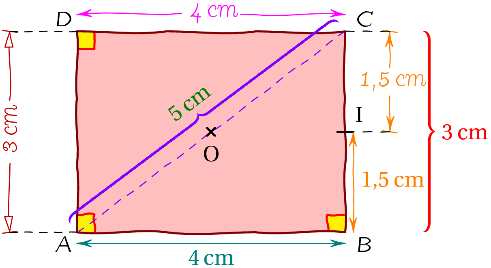

# mageo #

Set of geometry routines for Aymptote, the vector graphics language (http://asymptote.sourceforge.net/) with modified dot (segment or cross) and modified routines distance for handwriting graphics using trembling.

## Installation ##

Just put the file mageo.asy in the same directory of your file, or better, put it in your .asy directory.

## Example ##

~~~c
import mageo;

usepackage("fourier","upright");
usepackage("numprint","np");

size(8cm);

tremble tr=tremble(angle=4,frequency=.3,random=6);
tremble tr2=tremble(angle=10,frequency=1,random=2);

pair A=(0,0), B=(4,0), C=(4,3), D=(0,3), O=(A+C)/2, pI=(B+C)/2;
path rec=tr.deform(A--B--C--D--cycle);

fill(rec,palered);
markrightangleTR(A,D,C,linewidth(bp)+red,Fill(Yellow),tr);
markrightangleTR(B,A,D,linewidth(bp)+red,Fill(Yellow),tr2);
markrightangleTR(C,B,A,linewidth(bp)+red,Fill(Yellow),tr2);
draw(rec,bp+brown);
draw(tr.deform(A--C,O),dashed+purple); // O magnetized

label("\cmf A",A,SW);label("\cmf B",B,SE);
label("\cmf C",C,NE);label("\cmf D",D,NW);

dotc("$O$",O,2S,size=.5,angle=0,linewidth(bp));
dott("$I$",(pair)pI,2NE,B-C,.7,linewidth(bp));

brace(rotate(180)*"$5\;$cm", C, A, rotated = true, offset=3mm, pb=purple, pL=deepgreen);
brace("$3\;$cm", B, C, rotated=false, 1.5cm, red);

distunTR("\cmf 4\es cm", D, C, rotated = true, -3mm, magenta, tr);
distTR("$\np{1.5}\;$cm", B, pI, rotated = false, 1.5mm, orange, tr);
dist("$4\;$cm", A, B, rotated = true, 2mm, deepcyan);
distanceTR("\cmf 3\es cm", A, D, rotated = true, -12mm, heavyred,joinpen=dashed, tr);
distanceTR("\cmf 1,5\es cm", pI, C, rotated = false, 8mm, orange,joinpen=dashed, tr, Arrows(HookHead,1.5mm));
~~~

